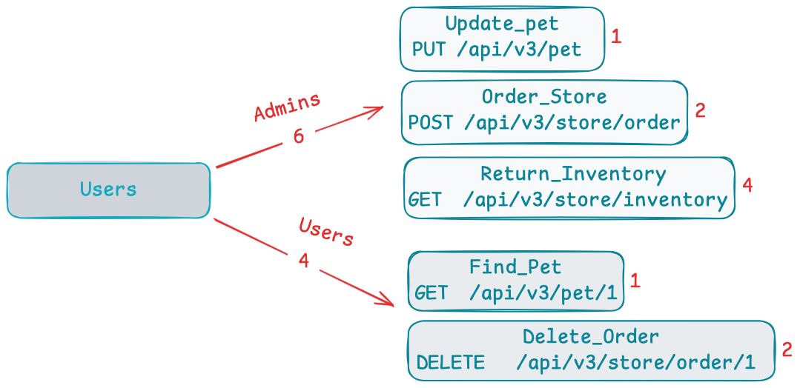

# Locust Basics
Scripting usage and concepts of *locust*.

## Example 1
HTTPs request from classes to runner script and executed from locust CLI.

1. Folder `00_request_example`
2. Scenario parameters:
    ```text
   - Host: http://localhost:8080/api/v3
   - Use Case: POST /order/store
   - Users: 10
   - Cores: 4
   - Time duration: 20 sec
   ```
3. Command execution:
    ```bash
    $ locust -f runTest.py --host http://localhost:8080/api/v3 -u 10 -t 20 --processes 4 --autostart --autoquit 3
    ```

## Example 2
Performance load scenario from classes to runner script and executed from locust CLI.

1. Folder `01_load_example`
2. Scenario parameters:

3. Command execution:
    ```bash
    $ locust -f runTest.py --host http://localhost:8080/api/v3 -u 10 -t 20 --processes 4 --autostart --autoquit 3
    ```
